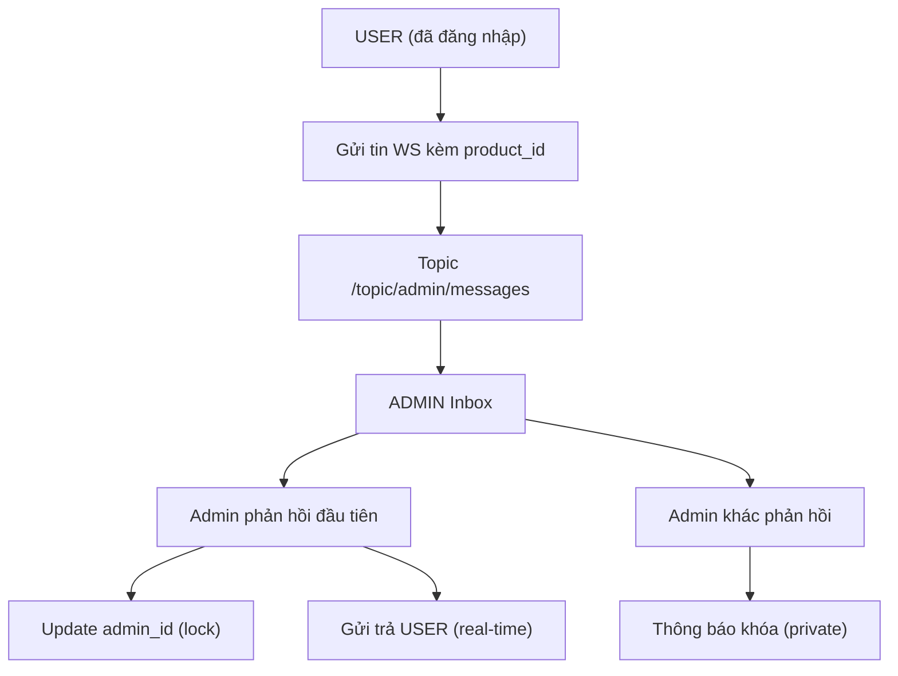

## 1. Product Overview

Hệ thống chat real-time giữa USER (tài khoản đã đăng nhập, role = USER) và Admin CSKH trên website.
Chat gắn với ngữ cảnh sản phẩm (product context) để USER gửi yêu cầu hỗ trợ theo từng sản phẩm.
Mục tiêu: hỗ trợ tức thời, lịch sử truy vết theo sản phẩm, và cơ chế “khóa chat” để tránh nhiều Admin trả lời chồng chéo.

## 2. Core Features

### 2.1 User Roles

| Role  | Điều kiện | Core Permissions |
| ----- | --------- | ---------------- |
| USER  | Đã đăng nhập, role = USER | Mở ChatBox, chọn sản phẩm (product context), gửi/nhận tin nhắn real-time, xem lịch sử chat theo sản phẩm, gửi ảnh (tùy chọn) |
| ADMIN | Đã đăng nhập, role = ADMIN | Nhận tất cả tin nhắn mới của USER theo product context, phản hồi real-time, “nhận hỗ trợ” bằng cơ chế khóa chat, xem lịch sử theo (customer_id, product_id) |

### 2.2 Feature Module

Tính năng được nhúng vào Web App hiện có (không cần “trang bắt đầu chat”).

1. **ChatBox (USER)**: widget cố định góc phải dưới, hiển thị hội thoại theo sản phẩm đang chọn.
2. **ProductModal (USER)**: chọn product context từ “Giỏ hàng” và “Đã mua”.
3. **Admin Inbox (ADMIN)**: giao diện trong khu vực Admin để xem các luồng chat theo (customer_id, product_id) và trả lời.

### 2.3 Page Details

| Surface | Module | Mô tả |
| --- | --- | --- |
| ChatBox (USER) | Kết nối real-time | Thiết lập WebSocket STOMP (SockJS), auto reconnect, hiển thị trạng thái kết nối |
| ChatBox (USER) | Hội thoại theo sản phẩm | Danh sách tin nhắn theo `product_id`, tự tải lịch sử, auto-scroll |
| ChatBox (USER) | Soạn & gửi | Nhập nội dung, chặn gửi rỗng, gửi ảnh (upload REST), gửi tin nhắn WS |
| ChatBox (USER) | Product Context | Header hiển thị sản phẩm hiện tại, nút “Thay đổi” mở ProductModal |
| ProductModal (USER) | Tab “Giỏ hàng” | Gọi API cart, chọn sản phẩm để chat |
| ProductModal (USER) | Tab “Đã mua” | Gọi API order với `DELIVERED_SUCCESS`, chọn sản phẩm để chat |
| Admin Inbox (ADMIN) | Nhận tin nhắn | Tất cả Admin subscribe `/topic/admin/messages` để nhận tin từ USER |
| Admin Inbox (ADMIN) | Khóa chat | Admin trả lời đầu tiên sẽ “nhận hỗ trợ”; các Admin khác bị khóa và nhận thông báo riêng |

## 3. Core Process

**Luồng USER**: Mở ChatBox → chọn sản phẩm (product context) → gửi tin nhắn (kèm `product_id`) → nhận phản hồi real-time từ Admin → xem lại lịch sử theo sản phẩm.

**Luồng ADMIN**: Subscribe `/topic/admin/messages` → nhận tin nhắn từ USER (kèm `product_id`) → chọn luồng chat (customer_id, product_id) → gửi phản hồi.

**Cơ chế khóa chat**:

1. Tin nhắn đầu tiên của USER được lưu với `admin_id = NULL`.
2. Admin gửi phản hồi đầu tiên:
   - Backend cập nhật toàn bộ bản ghi chưa có admin theo (customer_id, product_id): `SET admin_id = adminUsername WHERE admin_id IS NULL`.
3. Admin khác gửi tiếp:
   - Backend kiểm tra `admin_id` hiện tại; nếu đã thuộc về Admin khác → từ chối và gửi thông báo “đã được nhận hỗ trợ bởi Admin [Tên]” qua kênh riêng cho Admin đó; UI Admin disable ô nhập.

