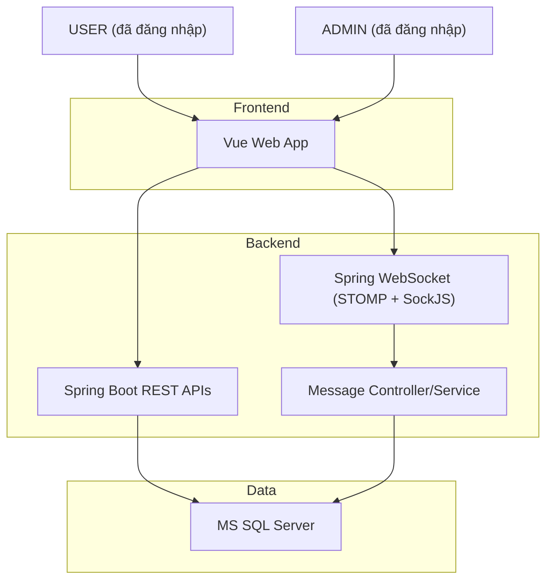
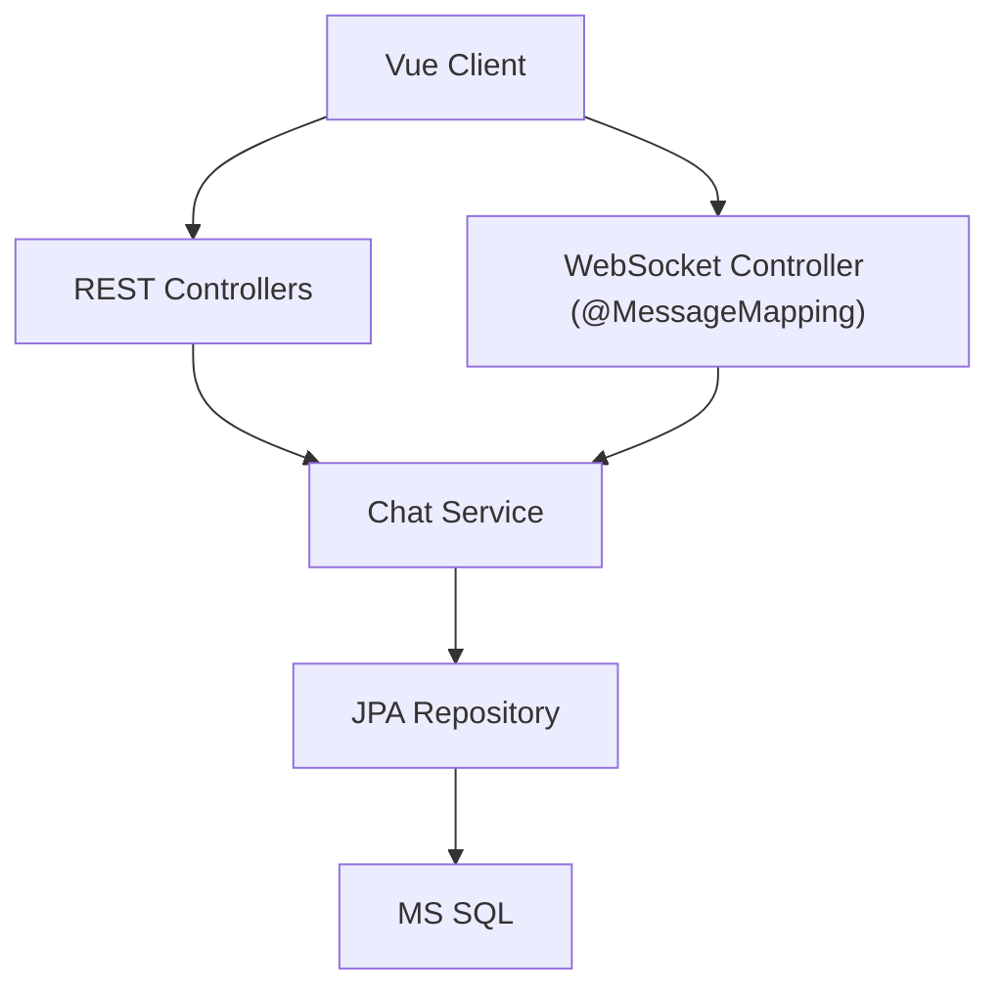
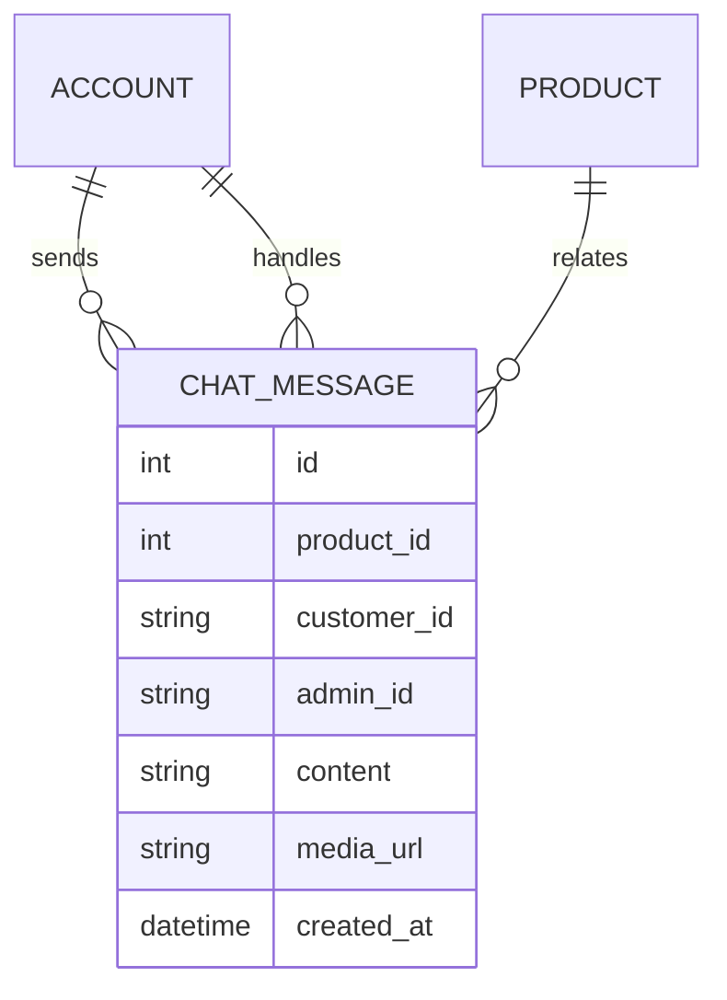

## 1. Architecture design



## 2. Technology Description

- Frontend: Vue@3 (Script Setup + Composition API) + stompjs + sockjs-client
- Backend: Spring Boot + Spring WebSocket (STOMP) + Spring Security + Spring Data JPA
- Database: Microsoft SQL Server

## 3. UI Surface

- USER: ChatBox được nhúng vào các trang sản phẩm/giỏ hàng/đã mua (không cần route riêng).
- ADMIN: giao diện trong khu vực Admin để đọc luồng chat theo (customer_id, product_id) và phản hồi.

## 4. API definitions

### 4.1 REST (tối thiểu)

- `GET /api/chat/messages?productId=...` (USER: lấy lịch sử chat theo sản phẩm của chính mình)
- `GET /api/admin/chat/messages?customerId=...&productId=...` (ADMIN: lấy lịch sử theo khách + sản phẩm)
- `POST /api/chat/upload` (USER/ADMIN: upload ảnh chat; trả `mediaUrl`)

Ghi chú: API “Giỏ hàng” và “Đã mua” dùng lại API hiện có (cart, orders).

### 4.2 WebSocket (Spring WebSocket + STOMP)

- WS endpoint (SockJS): `/ws`
- Send message (client -> server): `/app/chat.send`
- Admin subscribe nhận tin từ USER: `/topic/admin/messages`
- USER subscribe nhận phản hồi từ Admin: `/user/queue/messages`
- Admin subscribe nhận thông báo khóa/lỗi riêng: `/user/queue/chat-lock`

### 4.3 Shared types (TypeScript)

```ts
export type SenderRole = "USER" | "ADMIN";

export interface ChatMessageDto {
  id: number;
  productId: number;
  customerId: string; // accounts.username
  adminId: string | null; // accounts.username
  senderRole: SenderRole;
  content: string | null;
  mediaUrl: string | null;
  createdAt: string;
}

export interface ChatSendPayload {
  productId: number;
  customerId?: string; // chỉ gửi từ ADMIN; USER sẽ lấy từ Principal
  content?: string;
  mediaUrl?: string;
}

export interface ChatLockNotice {
  productId: number;
  customerId: string;
  assignedAdminFullname: string;
  message: string;
}
```

## 5. Server architecture diagram



## 6. Data model

### 6.1 Data model definition



### 6.2 Data Definition Language (MS SQL)

```sql
CREATE TABLE chat_messages (
  id INT IDENTITY(1,1) PRIMARY KEY,
  product_id INT NOT NULL,
  customer_id VARCHAR(50) NOT NULL,
  admin_id VARCHAR(50) NULL,
  content NVARCHAR(MAX) NULL,
  media_url VARCHAR(MAX) NULL,
  created_at DATETIME NOT NULL DEFAULT GETDATE(),
  CONSTRAINT FK_chat_messages_products FOREIGN KEY (product_id) REFERENCES products(id),
  CONSTRAINT FK_chat_messages_customer FOREIGN KEY (customer_id) REFERENCES accounts(username),
  CONSTRAINT FK_chat_messages_admin FOREIGN KEY (admin_id) REFERENCES accounts(username)
);

CREATE INDEX idx_chat_messages_customer_id ON chat_messages(customer_id);
CREATE INDEX idx_chat_messages_product_id ON chat_messages(product_id);
```

### 6.3 Locking rule (service-level)

- Khi USER gửi tin đầu tiên: lưu bản ghi với `admin_id = NULL`.
- Khi ADMIN gửi tin phản hồi đầu tiên: thực hiện cập nhật khóa (idempotent) trong transaction:
  - `UPDATE chat_messages SET admin_id = :adminId WHERE customer_id = :customerId AND product_id = :productId AND admin_id IS NULL`
- Khi ADMIN khác gửi tin: nếu `admin_id` đã khác `adminId` hiện tại → từ chối và gửi `ChatLockNotice` qua `/user/queue/chat-lock`.
